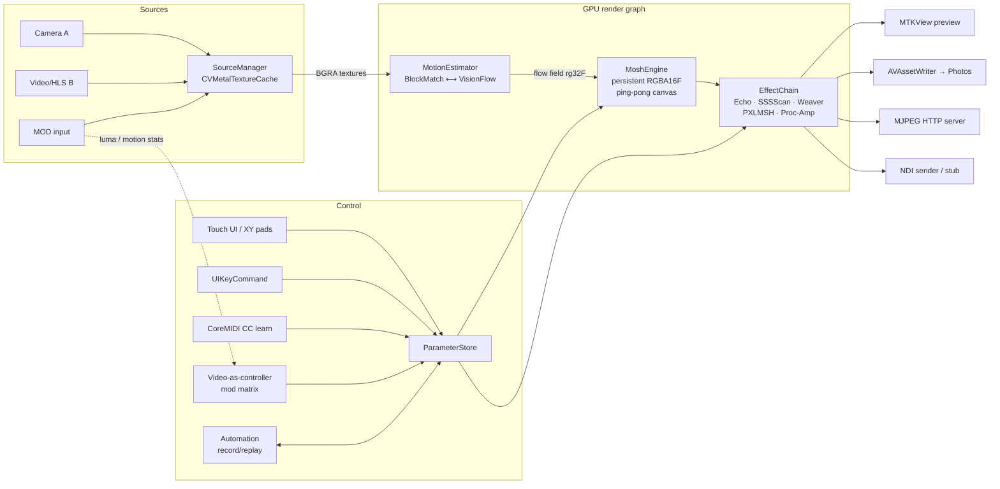

# MoshPit

A real-time datamoshing video instrument for iOS, inspired by Signal Culture's
*Interstream*. Point it at a camera, a video file, or an HLS stream and play
the decay like an instrument: smear, bloom, drift, cross-mosh between two
sources, and feed the result to Resolume/OBS over the network.

- **iOS 17+, iPhone & iPad.** SwiftUI chrome, Metal compute for every pixel,
  AVFoundation for capture/playback/recording.
- **No dependencies.** Builds with `xcodebuild` out of the box.

## Build

```sh
# App
xcodebuild -project MoshPit.xcodeproj -scheme MoshPit \
  -destination 'generic/platform=iOS Simulator' build

# Tests (ParameterStore, automation record/replay, block-match estimator)
xcodebuild -project MoshPit.xcodeproj -scheme MoshPit \
  -destination 'platform=iOS Simulator,name=iPhone 17 Pro' test
```

To run on device, open in Xcode and set your signing team. If shader
compilation fails with a missing-tool error, run
`xcodebuild -downloadComponent MetalToolchain` once.

NDI output requires dropping in the NDI Advanced SDK — see
[docs/NDI_SETUP.md](docs/NDI_SETUP.md). Without it, use the built-in
MJPEG-over-HTTP server (`http://<device-ip>:8080/stream`) or ReplayKit screen
broadcast.

## Architecture



Everything between ingest and output lives on the GPU; the CPU only runs
capture callbacks, the parameter store, and UI. The render loop is
triple-buffered with a semaphore and allocates nothing at steady state
(textures are pre-allocated; the effect ring buffer lives in an `MTLHeap`).

### Files

| Path | What |
|---|---|
| `MoshPit/Shaders/Mosh.metal` | Block matching + the mosh canvas kernel (all 7 modes, commented math) |
| `MoshPit/Shaders/Effects.metal` | Echo, slitscan, weaver, pixel sort, proc-amp, blit, preview quad |
| `MoshPit/Engine/` | Metal context, estimators, `MoshEngine`, `EffectChain`, renderer |
| `MoshPit/Sources/` | Camera / player(HLS) sources, slot manager |
| `MoshPit/Core/Parameters.swift` | `ParameterStore`, automation record/replay |
| `MoshPit/Control/Controls.swift` | CoreMIDI CC-learn, video mod matrix |
| `MoshPit/Output/Outputs.swift` | Recorder, MJPEG server, NDI wrapper |

## Moshing theory: motion vectors vs. codec moshing

Classic datamoshing edits the compressed bitstream: delete an I-frame (a full
keyframe) from an MPEG/H.264 file and the decoder happily applies the
following P-frames — motion vectors plus residuals — to the *wrong* reference
image. Content moves the way the new video moves, but drags the old video's
pixels with it. Two problems make that unusable live: you'd need to encode,
mangle, and decode in the same millisecond budget, and hardware decoders
error-conceal instead of glitching.

MoshPit reproduces the effect one level up, losslessly:

1. **Estimate motion** between consecutive *source* frames — exactly the
   information a video encoder would pack into P-frames. The default estimator
   is a 16×16 macroblock SAD search (`blockMatch` kernel), deliberately the
   same primitive MPEG encoders use, so vectors come quantized to chunky
   blocks. Block size (4/8/16/32) is a first-class parameter because it *is*
   the look. A `VNGenerateOpticalFlowRequest` backend gives smooth per-pixel
   fields when you want melt instead of blocks.
2. **Apply that motion to the wrong image.** A persistent RGBA16Float canvas
   is warped through the motion field every frame (`moshCanvas` kernel) and
   never cleared. That canvas is the "wrong reference frame", forever.
3. **Admit fresh pixels only by rule.** I-frames and residuals are replaced by
   per-mode admission: never (Classic Smear), where motion exceeds a threshold
   on a timer (Bloom / Timed Multi-Directional Bloom), a constant blend (Mix
   Mosh), from the *other* source (Cross-Mosh), or after a zoom/rotate/hue
   feedback transform (Feedback Mosh). `Reset` is a manual I-frame.

Because the smear is a resampling operation, not accumulated codec error, it
is numerically stable: the canvas is clamped each pass and an optional 0–2%
"heal" leak prevents drift to black/white while remaining off by default for
true perpetual moshing. Motion can be estimated at 180p and applied to a 1080p
canvas — vectors upscale nearest-neighbor (blocky, authentic) or bilinear
(smooth toggle).

## Performance

Targets: 60 fps at 540p canvas on A15, ≥30 fps at 1080p. The debug HUD (gauge
button) shows fps, GPU ms, and estimator ms; every pass is labeled for
`MTLCaptureManager`. On serious/critical thermal state the estimator drops two
resolution steps automatically and the HUD warns.

## Signal Culture expansions

- **Strukt** (Re:Struktr) — two-LFO rhythm engine (sine/square/triangle/saw/
  S&H, free Hz or tap-tempo divisions 1/1-1/16, phase, depth). LFOs are mod-
  matrix sources for any parameter plus three dedicated strobe destinations:
  A/B source flip on rising edges, gated color invert, and blackout/whiteout
  flash (`Strukt.metal`). A flicker limiter (on by default) caps strobing at
  3 Hz; raising it shows a one-time photosensitivity warning. `T` = tap tempo.
- **Trace** (Re:Trace) — alternate 3D render path: the moshed canvas is
  sampled by a 32²-256² vertex grid drawn as point cloud (optional additive
  glow), wireframe, or solid triangles, with luma-driven displacement and
  feedback trails. One-finger orbit / two-finger zoom; auto-rotate.
- **Mass** (V-Mass) — the canvas texture wraps procedural primitives (plane,
  cube, sphere, torus) with per-axis spin; all Trace render modes apply.
- **Mixer** (Video Mixer) — pre-canvas A/B crossfader with plain crossfade,
  luma wipe (threshold sweeps brightness, softness feathers the edge), and
  MOD-keyed mask wipe. The wiped frame FEEDS the mosh engine, and the
  crossfader is a prime LFO destination for rhythmic, moshable source cuts.

## Consumer conveniences

- **Reverse playback** — per-slot toggle in Sources for any file/stream video
  (`⇧R` for the active slot). Plays the clip backwards (rate −1 with the
  required seek-to-end handling) and loops end→start; the HDR tone-map and
  frame-pull path are direction-agnostic. A ◀◀ badge marks reversed slots.
- **Mirror modes** — None / Horizontal (left→right or right→left) / Vertical /
  Quad kaleidoscope, in Effects (`M` cycles). Runs as a post-chain finisher
  pass at canvas resolution, so preview, recordings, NDI, and MJPEG all get it.
- **Color modes** — None / Invert / Duotone (configurable shadow + highlight
  hues) / Hue Shift (0–360°, a great LFO destination), in Effects (`C`
  cycles). Same finisher pass, all parameters mod-matrix routable.
- **Save as image** — camera button in the bottom bar: shutter flash + haptic,
  the next frame's post-finisher canvas is read back without stalling the
  render loop and saved to Photos (permission prompted once; denial shows a
  toast). What you see is what you save.

Screenshots in [docs/screenshots](docs/screenshots).

## Playing it

- **1–7** or the mode bar: switch modes (hard cuts, mid-mosh).
- **XY pad**: drift joystick; re-mapped per mode (threshold/rate, bloom angle,
  feedback offset…).
- **Space** bloom, **R** reset, **⌘R** record, **⇧R** reverse clip,
  **M** mirror, **C** color mode, **F** performance mode, **?** cheat sheet.
- **MIDI**: long-press any slider label, twist a knob — bound and persisted.
- **Mod matrix**: route the MOD input's mean luma / motion amount / motion
  direction to any parameter.
- **Automation**: record every knob move as a take; replay it, looped, over a
  completely different source.
